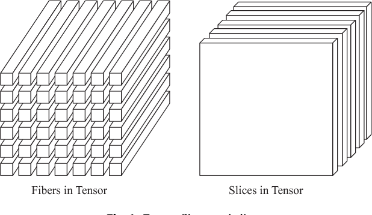

```{r, include = FALSE }
knitr::opts_chunk$set(collapse = TRUE)
library(tidyverse)
```


# Introduction

R is a rich software language for "programming with data" to quote the chief designer John Chambers [@chambers1998programming] of the precursor and inspiration for R - the S programming language. While diverse in its applications, R is based on a few unifying design principles that allows one to separate the forest from the trees in developing R software for solving a problem. A useful summary of these principles for understanding the behavior of R code is captured by the memorable [slogans](https://www.r-bloggers.com/three-deep-truths-about-r/):

1. 
>Everything in R is an object. 
>
> --- John Chambers

2. 
>Everything that happens in R is the result of a function call. 
>
> --- John Chambers

3. 
>Names have objects, objects don't have names. 
>
> --- Hadley Wickham


We will refer to these principles as the *deep truths* of R. Although these principles are omnipresent in R, they are reaffirmed and take center stage in the jump from "base R" (the original, core R language) to "modern R" as formalized by the **Tidyverse** ecosystem of packages.^[The tidyverse is a standardization and formalization of functional and meta-programming capabilities of R. The popularization and resurgence of R through the tidyverse owes an unusual amount to the influential packages and writings of Hadley Wickham - the author of *Advanced R* and co-author of *R for Data Science*.] 

The first of these principles is arguably the most important to initiate an understanding of the full trilogy, and we begin our discussion there. 

# Everything in R is an Object


Every entity that gets used in R is an object of some kind, and all computations involve constructing and manipulating objects in some form. 

However, the word "object" has many connotations in computer programming, particularly in relation to "object-oriented programming". Hence it is crucial to recognize the more general meaning of objects in R. 


"Everything in R is an object" in the sense of being a data structure that can be manipulated and analyzed. As @chambers1998programming writes, an object in R is a "dynamically created, self-describing container for data".

When complemented with the fact that R is a language designed to "program with data", this means that everything in R is analyzable as a data.  

This is arguably what fundamentally distinguishes R from other languages - it achieves the capabilities of general purpose programming language through a paradigm that is centered around data structures and analysis of those structures. 


There are certain universal data characteristics shared by all objects. Every object in R has (1) a *mode* or *type* and (2) a *length*. These are intrinsic attributes of every R object. 

```{r, collapse=TRUE}
mode(1:10) #mode
typeof(1:10) #type
length(1:10) #length
```


All other attributes of an R object are should be seen as metadata associated with the object. This metadata is attached to the main object but subordinate in status. These attributes can be found en masse through a call to `attributes`

```{r}
attributes(1:10)
```
In this case the object has no additional attributes beyond its intrinsic attributes and hence the call returns a `NULL` value. More generally, attributes are represented as a named list in R and can have value `NULL`

```{r}
x <- matrix(1:9, nrow = 3)
attributes(x)
typeof(attributes(x))
```

The fact every object has a length means they are vector-like in some fashion and can be approached as a data structure, e.g., we can access, manipulate, and analyze any R object through common data techniques, e.g., the data underlying an object  `x` can be examined via a subsetting operation `x[[i]]` for `i` from `1:length(x)`.  


Of course, the interpretation of this data depend on the object type. The mode or type separates (1) data objects from (2) language objects. The data objects have modes that include `numeric` `integer`, `character`, `logical`, etc, whereas the language objects include `function`, `call`, `expression`, etc. Whereas the *mode* attribute was central to R's precursor language S, object types are a more common to distinguish different families of objects. The type of an object we will reference as its *base type* (to distinguish from what we will later discuss as the object's "class", which is an enrichment of the object's base type).

There are a fixed set of 25 types defined by core-R. They are listed below, categorized by their distinct data interpretation.

*   Vectors include types `NULL`, 
    `logical`, `integer`, `double`, `complex`, `character`, `list`, and `raw`.
    
    ```{r}
    typeof(NULL)
    typeof(1L)
    typeof(1i)
    ```

*   Functions include types `closure` (regular R 
    functions), `special` (internal functions), and 
    `builtin` (primitive functions).
    
    ```{r}
    typeof(mean)
    typeof(`[`)
    typeof(sum)    
    ```
    
    

*   Environments have type `environment`.

    ```{r}
    typeof(globalenv())
    ```

*   The `S4` type is used for S4 classes that 
    don't inherit from an existing base type.
   
    ```{r}
    mle_obj <- stats4::mle(function(x = 1) (x - 2) ^ 2)
    typeof(mle_obj)
    ```

*   Language components include `symbol` (aka 
    name), `language` (usually called calls), and 
    `pairlist` (used for function arguments) types.

    ```{r}
    typeof(quote(a))
    typeof(quote(a + 1))
    typeof(formals(mean))
    ```
 
    `expression` is a special purpose type that's only returned by
    `parse()` and `expression()`. Expressions are generally not needed in user 
    code.
 
*   The remaining types are esoteric and rarely seen in R. They are important 
    primarily for connections to C code: `externalptr`, `weakref`, 
    `bytecode`, `promise`, `...`, and 
    `any`.


## Vectors

The standard objects in R are vectors which come in two distinct stripes - atomic vectors in which each element is a common data type, and lists (sometimes called generic or recursive vectors) in which elements can be any object including other lists. 

```{r, echo = FALSE, out.width = NULL}
knitr::include_graphics("adv-r/diagrams/vectors/summary-tree.png")
```


Atomic vectors are built from the primary atomic types - integer, double, logical, and character.^[Two other atomic types are more rarely used - complex and raw.] Integers and doubles are collectively referred to as numeric vectors. 
```{r, echo = FALSE, out.width = NULL}
knitr::include_graphics("adv-r/diagrams/vectors/summary-tree-atomic.png")
```

Scalars of each atomic type has a specific syntax.
```{r}
#A double
typeof(1.3)
#An integer
typeof(1L)
#A logical
typeof(T)
typeof(FALSE)
#A character
typeof("hello")
```
Each atomic object above is a scalar, e.g., a vector of length 1. 
```{r}
length(1)
1[1]
```
We can allocate space for a vector before filling out its elements (a common technique when using for-loops to build up a computation).
```{r}
vector("character", length = 5)
```
This in principle allows for the creation of zero length vectors
```{r}
vector("character", length = 0)
```
which has the interpretation that if the object contained any elements at all, they would be characters. 

This is rather distinct from the `NULL` object, which is a zero length vector of type `NULL`, e.g., an empty container is distinct from no container at all. 
```{r}
length(NULL)
typeof(NULL)
is.null(5)
```
`NULL` is used to indicate the presence of nothingness. For example, what are the names for a vector without a names attribute.
```{r}
names(c(1,2))
```


Larger vectors can be constructed from smaller vectors using the combine (or concatenate) function `c()`, which allows for elements to be named and automatically coerces arguments of different types to a common type using the precedence: character $\rightarrow$ double $\rightarrow$ integer $\rightarrow$ logical.

```{r}
#Naming and Coercion in action
v <- c(4., m = 5, t= c(x = 1.5, y = 2L, z = "hello"))
v
attributes(v)
```

The above computation should be seen as combining 3 vectors - two length 1 vectors (one of which is named), and a named length 3 vector. The end result is a named length 5 vectors. Observe the **names** attribute is a character vector associating each element with a name. The names list can be automatically formed when creating the vector `v`, but can be changed and removed

```{r}
v <- setNames(v, c("a", "b", "c", "d", "e"))
v
unname(v)
```


An atomic vector can be explicitly coerced to a different base type using the `as.*()` functions, which could result in missing values due to failed coercion of strings.
```{r}
as.integer(v)
```
Observe the value `NA` in the vector- short for "Not Applicable" - which R uses to represent missing or unknown values. Technically, When `NA` is used in an atomic vector is automatically coerced to the appropriate type.^[There are technically four missing values, one for each of the atomic types: `NA` (logical), `NA_integer_` (integer), `NA_real_` (double), and `NA_character_` (character).]

```{r}
typeof(as.integer(v))
is.na(as.integer(v))
```

We can subset a vector to generate another vector via the the subsetting function`[` that is called as `x[a]`. The subsetting argument `a` is a vector that can take 3 possible forms:

1. An integer vector which are either all positive or negative (or zero). This will subset by position.
```{r}
x <- c("one", "two", "three", "four", "five")
x[c(3,3,2,5)]
```
where negative integers will drop the corresponding position
```{r}
x[c(-1,-3,-5)]
```

2. A logical vector that selects the corresponding positions of `x` where `a` is `TRUE`. When `a` and `x` are different length, standard recycling rules are applied. 
```{r}
x[x == "one"]
x[!(x == "one")]
x[c(T, F)] #recycling rules are applied
```
3. A character vector that selects elements via their names
```{r}
x <- purrr::set_names(x) # A TidyVerse alternative to stats::setNames
x[c("three", "two", "one")]
```
Subsetting with a blank argument as in `x[]` returns x itself. This is useful in subsetting with matrices and arrays (discussed next), and also allows us to distinguish between the contents of `x` and the object `x` as a whole

## Arrays
Atomic vectors on the surface might appear to be limited data structures for empirical work - in particular they are subset using a single index, e.g., `x[i]`. This would seemingly preclude multidimensional arrays, aka tensors.  

What are tensors? Tensors are multi-dimensional arrays, e.g., generalizations of vectors and matrices to higher dimensions. Mathematically, tensors are objects with multiple indices, e.g., arrays of mathematical objects. A scalar object does not have an index, and a vector has one index. Hence tensors are generalizations of vectors. 

It is useful to establish basic taxonomy given that references to *dimension* can be ambiguous in the context of tensors between the mathematical and software discussions of the subject. Let us fix the terminology upfront. We will use the term *axes* (or *modes* or *ways*) to reference the different indices used to reference components of a tensor (e.g, rows are the first axis, columbs the second axis, etc). Then the term *dimension* can be reserved to reference the length an each axis. The number of axes then corresponds to the *rank* or *order* of the tensors, and the *shape* of a tensor would be a vector of length equal to the rank of the tensor and whose entries are integers corresponding to the dimension of the corresponding axis. 


A vector in a finite dimensional real vector space is represented in R as a numeric vector. 

```{r}
v <- c(1,2,3,4)
```

Building a tensor from an vector in R is simply a matter of adding attributes to the vector. In particular tensors are formally distinguished in R (e.g., multi-index vectors) as arrays and the defining characteristic of an array is that it has a dimension attribute.


```{r}
dim(v) <- c(2,2)
attributes(v)
is.array(v)
is.vector(v)
length(dim(v)) #this is the rank of the tensor
dim(v) #this is the shape of the tensor
length(v) #this is the number of elements in the tensor
```

Observe that the `dim(v) <- c(2,2)` statement sets the `dim` attribute of `v`.
We can further assign a `names` attribute for each axis of the tensor as well (which for arrays is a `list` object associated with the `dimnames` attribute)
```{r}
dimnames(v) <- list(c("a", "b"), c("d", "e"))
v
```

We can build an array alternatively by generically packaging the data and attributes through the `structure` function

```{r}
v <- structure(c(1,2,3,4), dim = c(2,2), dimnames = list(c("a", "b"), c("d", "e") ))
is.array(v)
```

Finally we can directly use the `array` function which is more readable shorthand for the above

```{r}
v <- array(c(1,2,3,4), dim = c(2,2), dimnames = list(c("a", "b"), c("d", "e") ))
v
```


Thus although a vector without a `dim` attribute set may intuitively be thought of as 1-dimensional array,  a pure vector in R would actually have a `NULL` for its dimensions attribute, and thus technically distinct from a one dimensional array. We can remove the `dim` to return it to a state as a simple vector. 

```{r}
dim(v) <- NULL
attributes(v)
is.array(v)
is.vector(v)
```

However we could alternatively explicitly define a rank 1 tensor
```{r}
v <- array(c(1,2,3,4), dim = c(4))
is.array(v)
is.vector(v)
str(v)
str(v %>% `dim<-`(NULL)) #replacement functions to be discussed later
```

Observe the difference in object structure between the vector and the rank-1 array. 

Finally, we can reshape a tensor directly by altering its `dim` attribute
```{r}
dim(v) <- c(2,2)
v
```

Notice that it reshapes in accordance with *column major* order. To instead re-shape along *row major* order that is more prevalent in practice.
```{r}
dim(v) <- NULL
reticulate::array_reshape(v, dim = c(2,2))
```

Array subsetting is a natural generalization of vector subsetting. In particular we can subset each axis using standard vector subsetting techniques, and separate the arguments for each axis by a comma.
```{r}
v <- array(1:9, dim = c(3,3), dimnames = list(c("a", "b", "c"), c("A", "B", "C") ))
v
v[c("a","c"), c(1,2)]
v[c(T, F, T),]
```
Note that given the data underlying an array is just a plain atomic vector, if we use a single argument to subset an array, it will return a vector and the array will be treated as a long vector in column-major order that is subsetted appropriately.
```{r}
v[1:9]
```


There is one subsetting convention that is unique to arrays (and not shared by vectors). We can extract a vector of elements from the array by giving subsetting the array with a matrix argument (each row corresponding to one multi-index and the sequence of rows thus equating to a vector). Such matrix subsetting can be used for extraction or replacement. 
```{r}
v <- rnorm(100) %>% `dim<-`(c(50,2))
v[1:3,]
select <- matrix(nrow = 2, byrow = TRUE, c(
  2,1,
  2,2
))
str(v[select])
v[select] <- c(0,0)
v[1:3,]
```

When subsetting tensors, there are a few special cases of interest. A **fiber** is created when fixing all but one index, and a **slice** is created when fixing all but two indices. For a 3-rank tensor, the subsets are visualized below.
```{r, echo = FALSE, out.width = NULL}

```
A computational subtlety in forming fibers, slices, and their higher dimensional generalizations is that R will automatically reduce the sub-tensor to its lowest dimension - the shape of the array will adjust. This however can be controlled through the `drop` option in the subset function. This is relevant if we wish to retain the shape structure of a data object (e.g., a 2-way tensor representing a data matrix) even when selecting specific fibers (e.g., columns)
```{r}
v <- array(1:27, c(3,3,3))
str(v[1,,]) #An array fiber
str(v[1,,, drop = FALSE]) #an array fiber with the original structure of the data preserved
```


## Lists
Lists in R are another form of vectors, sometimes called generic vectors in that their elements can be arbitrary R objects (e.g., not constrained to atoms). They are also called recursive vectors because they can contain other lists, and hence a recursive data structure. 
A list object is created using the `list` function
```{r}
l1 <- list(a=1:3, b = function(x) x^2, c = list(d = 2, e = 2))
l1
```
Like atomic vectors lists can be named upon creation or after the fact
```{r}
names(l1)
setNames(l1, c("d", "e", "f"))
```
They can also be subset in the same fashion as atomic vectors, with the result being a list
```{r}
l1[1:2]
l1[c("a", "c")]
l1[sapply(l1, is.list)]
```
Individual objects constituting a list can be selected through the extract function `[[`. The syntax `l$z` is shorthand for `l[["z"]]`
```{r}
l1[["c"]]
l1$b
```
We can combine lists with the combine function `c()`, which will coerce atomic vectors into lists
```{r}
c(l1, c(3,4))
```
Finally given the extract function `[[` extracts a single element at a time, if we use a vector argument it will extract recursively, e.g., `x[[c(1,2)]]` is equivalent to `x[[1]][[2]]`
```{r}
l1[[c(3,1)]]
```
We can also add a `dim` attribute to a list to make its elements accessible in a grid-like form:
```{r}
l2 <- c(l1,5)
dim(l2) <- c(2,2)
l2[1,2]
l2[[1,2]]
```


## Names have Objects (not the other way around)

Vectors are the most fundamental base objects in R, and motivate the key patterns for querying and manipulating objects as data structures. As we saw in the previous section, there are a diverse set of objects defined in the core R language. To motivate the role of these objects, lets consider what we ultimately want to achieve with computations in R - *The primary purpose of programming in R is the creation and manipulation of objects.*

A key idea for this process to work is that the name of an object is quite distinct from the object itself. The act of binding names to objects and databases of names that are linked together in a hierarchical is fundamental to computations in R. 

To understand the distinction between names and objects, we begin by asking where do objects live when they are created in an R session? 
THe simple answer is that objects live in computer memory. Values of all computations are a *value* in general is an object residing in memory. 

We have already seen above how to create objects, but lets examine where they live. The address reference for an object can be recovered by `lobstr::addr()`
```{r}
lobstr::obj_addr(function(x) x^2)
lobstr::obj_addr(1:10)
lobstr::obj_addr(1:10)
```
Notice that two instances of the vector object `1:10` were created with distinct calls to `lobstr::obj_addr`. 

To manipulate objects we need a way to reference them. While we could in principle use their memory 

The fundamental goal of computations in R is to create and manipuate objects. How can we examine and analyze the same object in multiple computations. We bind a name to the value using the syntax `name <- value`. 

```{r}
lobstr::obj_addr(x <- 1:10)
lobstr::obj_addr(x)
```


## Expressions, and Evaluation
What happens in R
Commands are executed
Commands are either the assignment of a name to the value of an expression or they are an expression without an assignment. 
In the latter case, R will aim to evaluate the expression to produce a value. As the "R Language Definition" document states:

> When a user types a command at the prompt (or when an expression is read from a file) the first thing that happens to it is that the command is transformed by the parser into an internal representation. The evaluator executes parsed R expressions and returns the value of the expression. All expressions have a value. This is the core of the language.

How is an expression evaluated, e.g., how does an expression produce a value. The symbols/names in the expression are replaced with values (which live in memory) based on the association between names and values defined by the evaluation environment. Replacing names with values should ultimately reduce to an operation that happens natively in memory. The "lookup" process follows lexical scoping. 

Environments are like names lists except unordered - e.g, bag of names.

Objects live in memory "somewhere". Names on the other hand are associated to environments and bind names to objects. 

If an object has no names pointing to it, it gets automatically deleted by the garbage collector. This process is described in more detail in gc.

## Functions

Functions objects are defined by `function(argument list) body`, e.g., 
```{r}
f <- function(x,y) {
  #comments
  x+y 
  
}
```
Functions are first class objects, e.g., data structures unto themselves. Although the length of a function is always 1, there are in fact 3 underlying pieces constituting a function - the formals, body, and environment. 

```{r}
typeof(f) 
length(f)
formals(f)
typeof(formals(f))
body(f)
typeof(body(f))
environment(f)
typeof(environment(f))
```
```{r}
as.list(f)
```

A central data component of R functions are their enclosing environments. Among programming languages, functions that capture (or enclose) their environments are called *closures*, and hence it is no surprise that the object type of a user defined function is

```{r}
typeof(f)
```

The enclosing environment is a data element of the function's structure as an object, e.g., it is established at the time of definition of the function. Hence in defining a function we are implicitly defining the environments where the function searches for values to associate with names in the sequence of statements it encounters during execution. 

The lookup process follows lexical scoping. To quote the 

Thus, when a variable is requested inside a function, it is first sought in the evaluation environment, then in the enclosure, the enclosure of the enclosure, etc.; once the global environment or the environment of a package is reached, the search continues up the search path to the environment of the base package. If the variable is not found there, the search will proceed next to the empty environment, and will fail.


is given by the `environment()` applied to a function.
Among programming languages, functions that capture (or enclose) their environments are called *closures*, and hence it is no surprise that the object type of a user defined function is


```{r}
typeof(f)
```

As an object, functions can be visualized with a pictorial that represents the formals and enclosing environments. The black dot on the left is the environment. The two blocks to the right are the function arguments. The body is excluded as it doesn't help you understand the shape of the function.

```{r, echo = FALSE, out.width = NULL}
knitr::include_graphics("adv-r/diagrams/functions/components.png")
```

A function binds the current environment when it is created - The current environment is the environment in which the code is currently executing. This binding can be pictured as an arrow from the function's black dot to the environment it binds. When a function is created interactively in R, the current environment is the global environment
```{r}
rlang::current_env()
```
and hence the and hence the environment bound to the function is often depicted as
```{r, echo = FALSE, out.width = NULL}
knitr::include_graphics("adv-r/diagrams/environments/binding.png")
```
In this case, `f()` binds the environment that binds the name `f` to the function.

Similar to any objects, functions have attributes. A default attribute that all functions share is the source code of the function (the `scref` attribute), which will verbatim give the user entered source code used as opposed to its representation as a formal expression that is result of `body(f)`.
```{r}
attributes(f)
```

Like other objects, names can be bound to the object and the function can be referenced via the name, i.e, 
```{r}
f <- function(x) x^2
f
```


However functions are objects unto themselves that exist independent of the a name bound to it, and hence can be used anonymously, which enables functional programming. 
```{r}
(function(x) x^2)(4)
```
As all objects are data objects in some fashion, functions can be stored in lists
```{r}
funs <- list (a = function(x) {a <- x+1; a^2}, b = function(y) {y+2})
funs$a(2)
funs$b(2)
```
Functions can return as objects other functions - e.g., one function can manufacture another function and thus act as a function factory - a single function that produces many other functions. 
```{r}
power1 <- function(exp) {
  function(x) {
    x^exp
  }
}

square <- power1(2)
cube <- power1(3)
square(3)
cube(3)
```
Functions can also take functions as arguments
```{r}
(function(x) x(3))(square)
(function(x) x(3))(cube)
```

## Function and Execution Environments

Notice in the case of `square` and `cube`, their environment does not equal the usual global environment.
```{r}
environment(cube)
environment(square)
```
This is a general outcome for functions produced by functions, e.g., function factories. This arises because every time a function is called, it is given a "fresh start", e.g., it receives a fresh environment to host its execution. As such the function has no "memory" of itself last time it was run.
```{r}

g11 <- function() {
  if (!exists("a")) {
    a <- 1
  } else {
    a <- a + 1
  }
  a
}

g11()
g11()
```

Notice that `g11()` returns the same value each time.^[The function `exists(x)` function looks to see if the name x has a value bound to it in the specified environment] This is because each invocation of `g11` created a new execution environment where the name `a` does not exist. The execution environment is created by invoking a function, and its parent is the function's enclosing environment. It is designed to be temporary - once the function has completed the function's execution environment is garbage collected.  


We can illustrate the evolution of the execution environment with the following simple function and call:
```{r}
h <- function(x) {
  # 1.
  a <- 2 # 2.
  x + a
}
y <- h(1) # 3.
```


```{r execution-env, echo = FALSE, out.width = NULL, fig.cap = "The execution environment of a simple function call. Note that the parent of the execution environment is the function environment."}
knitr::include_graphics("adv-r/diagrams/environments/execution.png")
```

There are a few cases where the execution environment is preserved beyond the function's completion:

1) Explicitly return it:

```{r}
library(rlang)
h2 <- function(x) {
  a <- x * 2
  current_env()
}

e <- h2(x = 10)
env_print(e)
fn_env(h2)
```

2) Return an object with a binding to that environment. This is what is happening in the case of function factories. The current environment when the function `cube` and `square` were created was the execution environment of a call to the function `power`. The separate calls created separate execution environments, and hence the environmental binding of each function is this otherwise temporary environment that is preserved through the fact that the function as a whole is returned, e.g., a closure binds the current environment and hence the execution environment is preserved. 

We can thus illustrate the full set of relationships in the function factory example as:
```{r, echo = FALSE, out.width = NULL}
knitr::include_graphics("adv-r/diagrams/function-factories/power-full.png")
```
A simplifying convention for this type of diagram is
* Any free floating symbol lives in the global environment.

* Any environment without an explicit parent inherits from the global 
  environment.

which yields
```{r, echo = FALSE, out.width = NULL}
knitr::include_graphics("adv-r/diagrams/function-factories/power-simple.png")
```


Finally,when `square()` executes `x ^ exp` 
```{r}
square(10)
```
It finds `x` in the execution environment and `exp` in its enclosing environment.
```{r, echo = FALSE, out.width = NULL}
knitr::include_graphics("adv-r/diagrams/function-factories/power-exec.png")
```


## The Calling Environment and Lazy Evaluation
A function object is distinct from a call to the function. The latter is carried out by evaluating a "call object". A call object is an expression capturing the action of calling a function, e.g, a language object. A call object is evaluated in the calling environment, which is distinct from the function environment.

When a function is called, its arguments are *lazily evaluated*, e.g., the formal argument name is bound to promise object that is only evaluated when the argument is used. 

For example the following function call does not return an error despite the argument not existing:
```{r}
f1 <- function(x) 10;
f1(notavalue)
```
whereas the following function returns an error due to the argument having an error in its evaluation:
```{r, eval = FALSE}
f1 <- function(x) 10+x;
f1(notavalue)
```
A promise object consists of 3 parts
1. An expression
2. An environment where the expression is evaluated, e.g., the calling environment
3. A value, which is computed and cached the first time the promise is accessed and the expression evaluated in the defined environment.

Thus consider
```{r}
f <- function(x) x
y <- f(z<-10)
lobstr::obj_addr(z)
lobstr::obj_addr(y)
```
In this case the assignment `z<-10` was evaluated in the calling environment when the call to `f` was asked to evaluate `x`. The evaluation led to the promise object being evaluated, which created an object (the vector `10`) that was associated to the name in the calling environment. The name `x` in the execution environment is bound to this value after the promise object is evaluated. As `x` is the value of the function, the name `y` is bound to the same object as `z`.


Given that functions are objects that can be passed to other functions, functions can be called in different ways. The standard function call encloses the arguments in parentheses separated 

two key features of R functions are (1) Lexical scoping and (2) Lazy Evaluation
Becayse of lazy evaluation, there is potential for quoted arguments in functions, e.g., the first time they are used in the function is through a quoted expression. 

```{r}
rlang::expr(f(x)) %>% typeof()
```


## S3 Classes and Vectors


## Metaprogramming

A remarkable manifestation of this quality of R is that the code itself, e.g., language expressions created by the user, are represented as objects. Thus the code itself can be manipulated as data and computed upon - a practice known as *metaprogramming*. Capturing code as data is assisted by `rlang::expr()` which captures code as an expression (to be elaborated in a separate note) and can then be manipulated like a data vector.

```{r}
f <- rlang::expr(f(x = 1, y = 2))
f
typeof(f)
f[[1]]
f$y <- 5
f
```
Functions are also ordinary objects

```{r}
#Define a function
f <- function(s) s^2
typeof(f)
f
```


## Vectors

The standard objects in R are vectors. Vectors come in two general forms - Atomic Vectors and Lists (or sometimes called "generic vectors").

The simplest constructor of vectors is the "concatenate" or "combine" function `c()`. The three most important vector types are `double`, `character`, and `logical`.

```{r}
mydata <- c(2.9, 3.4, 3.4, 3.7, 2.8, 2.8, 2.5, 2.4, 2.4)
mycolors <- c("red", "green", "blue", "white", "black")
mytest <- mydata > 3
typeof(mydata)
typeof(mycolors)
typeof(mytest)
emptydata <- double(0) # A zero length vector
emptydata
```


```{r}
f <- function(s) s+3
typeof(f)
length(f)
formals(f)
typeof(formals(f))
typeof(body(f))
```


## From Base Objects to OO Objects

However as Wikham writes (*Advanced R*, page 291), "while everything is an object, not everything is object-oriented.". This is because the S language, which is the basis for the core R language - was developed before the design of an OOP (Object Oriented Programming) system that introduced formal OO capabilities to the language. 

The original system - the S3 system - remains the simplest, most flexible, and most popular system used for R programming and package development. We focus attention on it here. To appreciate the S3 system, it is useful to observe that R is at heart a functional programming language, e.g., functions are **first-class functions**. This means that objects in R are functions just like any other object, e.g., they are just another data structure. It is not surprising then that the S3 system brings OOP capabilities through the thus adopts the OOP through a paradigm of *generic functions*, where the different methods for manipulating different classes of objects that achieve a common functionality are associated with a *generic* function. For example the `print()` function behaves differently

```{r}

```

Hence the objects in R will come in two flavors that we can designate *base objects* and *OO objects*. 

```{r, out.width = NULL, echo = FALSE}
knitr::include_graphics("./adv-r/diagrams/oo-venn.png")
```


Of course, the interpretation of this data depend on the object type. The type of an object we will reference as its *base type* - this is because irrespective of whether an object is a base object or an OO object, its underlying type belongs to a pre-defined set established by R-core. 


Hence even OO objects have a base type. What distinguishes OO types is that they will have at least an additional "class" attribute. The class attribute can then be seen as an extension of the functionality of its underlying base type. 

```{r}
attr(1:10, "class")
attr(mtcars, "class")
typeof(mtcars)
```
```{r}
mtcars
unclass(mtcars)
```


The class attribute allows R to represent rich objects as data structures. Take for example the result of running

```{r}
print
`+`
```


It is useful to examine this idea play out in the simplest of examples, which illustrates the general interconnection between the "deep truths". 

# Example: R as a calculator

The most basic usage of R is as a calculator. At the R command line, the user enters a calculation to be performed, and the result is stored in a variable whose value is returned to the screen, e.g., 

```{r}
x <- 1+1
x
```


There are at least 4 elements of this overall computation that bring the above "deep truths" to life. 

1. The abstract expression `1+1` - an object in R.

2. The evaluation of this expression to yield a result - a new object

3. The assignment of a name `x` to an object

4. The evaluation of the expression `x` that returns a printed output to the screen.

Lets peel the onion and consider each element in turn:

## The Abstract Expression and Metaprogramming

The commands that are entered into the command line are expressions. 
Expressions are object that represents an action that can be performed by R. 

In R, we distinguish between the action to be performed from the result of performing the action, e.g., separation of the operation from the result. Following the first truth - *everything in R is an object* - this distinction is implemented by the expression itself being a distinct object from the result of its evaluation. 

This separation however is buried under the hood from the user - when expressions are entered in the command line, they are automatically evaluated (and the result automatically printed if its not assigned to a name), e.g., 
```{r}
1+1
```


We can capture the the expression itself as distinct object from its result through the `rlang::expr()` function. 

```{r}
e <- rlang::expr(1+1)
r <- 1+1
```

Every object has two "intrinsic attributes" - a mode and a length.^[Hadley Wickham prefers the use of type rather than mode, arguing the latter is a relic of S rather and not germane to R] We can observe the clear distinction between the expression and result through querying the mode and type. 

```{r}
c(typeof(e), mode(e))
c(typeof(r), mode(r))
c(is.call(e), is.call(r))
```

We thus see the expression `e` is an object with type `r typeof(e)` and mode `r mode(e)` - or more simply say that `e` is an *call object*, which the `is.call()` test above makes clear.

Call objects are expressions that capture the action of calling a function. This elucidates the second truth listed above- *everything that happens in R is the result of a function call*! It turns out the expression `1+1` is a function call - but what function?

We can use the `lobstr:ast()` function to generate the *abstract syntax tree* (AST) for `e` to identify the function name behind the call. The abstract syntax tree for an expression describes the logical structure of the code for an expression. 

```{r}
lobstr::ast(!!e)
```

The branches of an AST are formed by the different function names (which have a colored circle next to them) in the expression while the leaves are its arguments. We thus see the function being called is ``+`` and thus alternatively we could alternatively call `1+1` as
```{r, collapse = TRUE}
`+`(1,1)
1+1
```

As an R object it also has a length (like a vector) that we can examine
```{r}
length(e)
```

Hence the expression `1+1` is a call object that calls the function named ``+`` and as a data structure has a length of `r length(e)`.

The expression captured code - a representation of actions to be performed by R. 


# Names, Assignments, and the Performance of For-Loops in R

A key distinction in R is between objects themselves and the names of objects. Of course, given that everything is an object, names are also objects and can in principle be assigned to a different name, e.g., 

```{r}
x <- quote(h)
x
mode(x)
typeof(x)
```

Observe the name `x` has been assigned an object value (the name `h`), but the name `h` does not have a value. 

A feature of R is that its objects are immutable. This behavior is discernible through the fact that objects and the names are logically distinct. Names in R are bound to objects. This can be illustrated with the 

```{r}
if (!require(lobstr)) {
  install.packages("lobstr")
  library(lobstr)
}
```

```{r}
x <- 1:3
cat(tracemem(x), '\n')

y <- x

y[[3]] <- 4

y[[3]] <- 7
```

Observe that both the name `x` and `y` both bind to the same object which has an identifier given by the function `obj_addr`.

R exhibit a distinct behavior known as **copy-on-modify** whereby changes to an object that are executed through reference to its name label are induced by first copying the object and and modifying the copy. This is another way of saying that objects in R are *immutable*.

```{r}
y[[1]]<-5
obj_addr(x)
obj_addr(y)
y[[1]]<-10
obj_addr(y)
```

```{r}
obj_addr(x)
obj_addr(y)
```

Notice the address of `y`has changed. If we modify `y` again, the identifier won't change because there is only a single name bound to the object, so R applies a **modify-in-place** optimization.

```{r}
y[[1]]<-10
obj_addr(y)
```

A similar principle applies to function calls. A function `function(a)` has a formal argument `a` which becomes a binding when the function is run. Observe the behavior

```{r}
f <- function(a) {
    a
}

z <- f(x)
obj_addr(x)
obj_addr(z)
```

Notice that the object bound to `x` never gets copied because `a` is never modified by the function. 

List objects are different in that they do not store the actual list values, but rather references to them. Thus when list objects are modified, the list object and its bindings are copied, but the values pointed to by the bindings are not copied. This is what is known as a *shallow* copy. 

```{r}
l1<-list(1,2,3)
l2<-l1
l2[[2]]<-8
ref(l1,l2)
```

Because data frames are lists of vectors, the copy-on-modify behavior of lists has important consequences for when a data frame is modified. Suppose a column is modified- then a copy of the data frame is made, but only a new value is created for the new column vector. 

```{r}
df <- data.frame(x = c(1,2,3), y = c(4,5,6))
df1 <- df
df1[,2] <- df1[,2]*2
ref(df,df1)
```

```{r}
ref(df,df1)
```

Since the elements of a list are references to values rather than the values themselves, the memory occupied by a list may be smaller than one might expect.

```{r}
x <- runif(1e6)
obj_size(x)
y <- list(x,x,x)
obj_size(y)
obj_size(list(NULL,NULL,NULL))
```

```{r}
obj_size(y)-obj_size(x)
```

```{r}
x <- 1:10
# Prints the current memory location of the object
tracemem(x)
# [1] "<0x7feeaaa1c6b8>"

x[5] <- 6L
```


```{r}
rm(x)
x <- 1:10
obj_addr(x)
pryr::refs(x)
x[[1]] <- 0
obj_addr(x)
y <- x
obj_addr(y)
y[[1]] <- 1.1
pryr::refs(y)
obj_addr(y)
y[[1]] <- 1.2
obj_addr(y)
```


Lets see. 